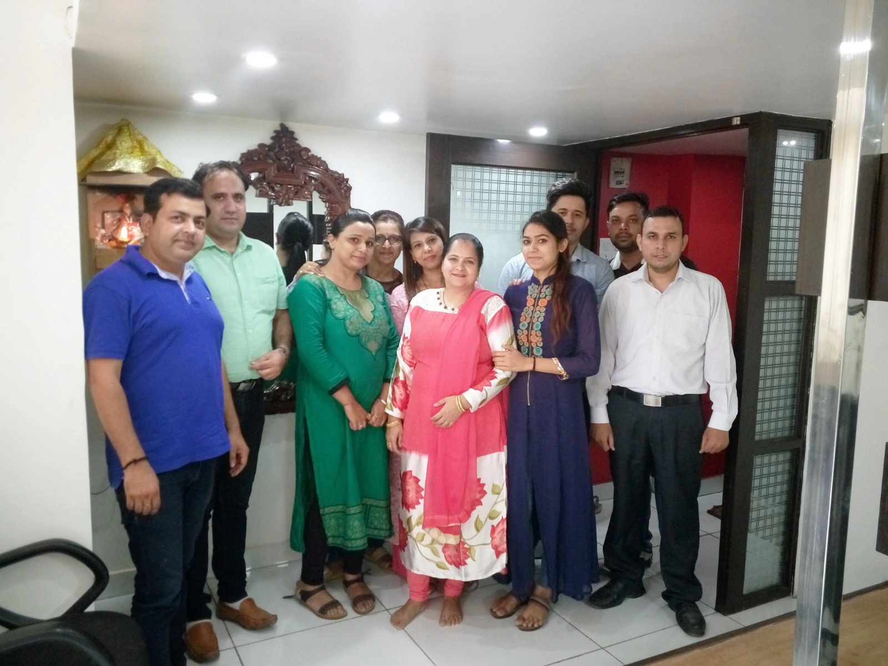

# 🧳 MiceTravelo - Travel & Group Tour Booking Website

Welcome to the source code for **[MiceTravelo](https://micetravelo.com/)** — a modern and responsive travel and group tour booking platform built for showcasing domestic and international travel packages with online visibility, destination pages, a blog, and more.

## 🌐 Live Website
🔗 [https://micetravelo.com](https://micetravelo.com)

---

## 📸 Overview
**MiceTravelo** is a travel company website offering:
- Group tours across India & international destinations
- Promotional packages with discounts
- Blog updates & travel inspiration
- Informational pages about services, terms, and policies



---

## 🚀 Features
- 🔍 **Explore Destinations**: Kashmir, Somnath, Srisailam, and more exotic locations
- 🎉 **Discounted Tour Packages** with date-based availability
- 🧭 **Hero Section** with compelling call-to-action
- 📊 **Stats Section** showcasing total customers, destinations, and tours
- 📷 **Gallery Integration** for visual storytelling
- ✍️ **Blog System** with travel insights and tips
- 📱 **Fully Responsive** & mobile-optimized design
- ⚡ **Fast Performance** with optimized images and assets
- 🎨 **Modern UI/UX** with smooth animations

---

## 🛠 Tech Stack

- **Frontend**: HTML5, CSS3, JavaScript (ES6+)
- **CSS Framework**: Bootstrap 4
- **Styling**: SCSS/Sass for modular CSS architecture
- **Animations**: AOS (Animate On Scroll) library
- **Icons**: Flaticon, Icomoon, Ionicons, Open Iconic
- **Fonts**: Custom web fonts with WOFF/WOFF2 support
- **Build Tools**: Prepros 6 for asset compilation
- **Performance**: Optimized WebP images for faster loading

---

## 📁 Project Structure

```
micetravelo/
├── 📄 index.html              # Homepage
├── 🏨 hotel.html             # Hotel listings
├── 🏨 hotel-single.html      # Individual hotel page
├── 🌍 destination.html       # Destinations overview
├── 🌍 destination-single.html # Individual destination
├── 📞 contact.html           # Contact page
├── 📝 single.html           # Blog post template
├── 📋 README.md             # Project documentation
├── 🎨 css/                  # Compiled stylesheets
│   ├── style.css           # Main stylesheet
│   ├── bootstrap/          # Bootstrap framework
│   ├── animate.css         # Animation library
│   ├── aos.css            # Animate On Scroll
│   └── magnific-popup.css  # Lightbox styles
├── 🎨 scss/                 # Source SCSS files
│   ├── style.scss          # Main SCSS file
│   └── bootstrap/          # Bootstrap source files
├── 🔤 fonts/               # Web font assets
│   ├── flaticon/          # Flaticon font family
│   ├── icomoon/           # Icomoon icons
│   ├── ionicons/          # Ionicons set
│   └── open-iconic/       # Open Iconic fonts
├── 🖼️ images/              # Image assets
│   └── office/            # Office/company images
├── ⚡ js/                  # JavaScript files
│   ├── main.js            # Core functionality
│   ├── aos.js             # Scroll animations
│   ├── google-map.js      # Maps integration
│   └── jquery.easing.1.3.js # Smooth animations
└── 📍 places/              # Destination-specific pages
    ├── kashmir/           # Kashmir tour details
    ├── somnath/           # Somnath pilgrimage
    └── srisailam/         # Srisailam temple tours
```

---

## 🚀 Getting Started

### Prerequisites
- Modern web browser (Chrome, Firefox, Safari, Edge)
- Local web server (optional but recommended)
- Code editor (VS Code, Sublime Text, etc.)

### Installation

1. **Clone the repository**
   ```bash
   git clone https://github.com/shahbaz1911/newmicetravelo.git
   cd newmicetravelo
   ```

2. **Open in browser**
   ```bash
   # Using Python (if installed)
   python -m http.server 8000
   
   # Using Node.js (if installed)
   npx serve .
   
   # Or simply open index.html in your browser
   ```

3. **For development with SCSS**
   - Install Prepros 6 or use any SCSS compiler
   - Watch `scss/style.scss` for changes
   - Compiled CSS will be generated in `css/style.css`

---

## 🎨 Customization

### Colors & Branding
Modify the primary variables in `scss/_variables.scss`:
```scss
$primary-color: #your-brand-color;
$secondary-color: #your-accent-color;
$font-family: 'Your-Font', sans-serif;
```

### Adding New Destinations
1. Create a new folder in `places/your-destination/`
2. Add `your-destination.html` with tour details
3. Update navigation links in main pages
4. Add destination images to `images/` folder

### Blog Posts
- Use `single.html` as a template for new blog posts
- Add featured images and meta descriptions
- Update blog listings on homepage and dedicated blog page

---

## 📱 Responsive Design

The website is fully responsive across all devices:
- **Desktop**: Full-featured experience with large imagery
- **Tablet**: Optimized layout with touch-friendly navigation
- **Mobile**: Streamlined design with collapsible menus

---

## 🔧 Development

### SCSS Compilation
```bash
# Watch for changes (using Sass CLI)
sass --watch scss/style.scss:css/style.css

# Compressed output for production
sass scss/style.scss css/style.css --style compressed
```

### Image Optimization
- Use WebP format for better performance
- Compress images before adding to `images/` folder
- Implement lazy loading for better page speed

---

## 🌟 Contributing

We welcome contributions! Please follow these steps:

1. Fork the repository
2. Create a feature branch (`git checkout -b feature/amazing-feature`)
3. Commit your changes (`git commit -m 'Add amazing feature'`)
4. Push to the branch (`git push origin feature/amazing-feature`)
5. Open a Pull Request

### Code Style Guidelines
- Use semantic HTML5 elements
- Follow BEM methodology for CSS classes
- Keep JavaScript modular and well-commented
- Optimize images and assets before committing

---

## 📄 License

This project is licensed under the MIT License - see the [LICENSE.md](LICENSE.md) file for details.

---

## 📞 Contact & Support

- **Website**: [https://micetravelo.com](https://micetravelo.com)
- **Email**: info@micetravelo.com
- **Developer**: [@shahbaz1911](https://github.com/shahbaz1911)

---

## 🙏 Acknowledgments

- **Bootstrap** for the responsive framework
- **AOS Library** for smooth scroll animations
- **Flaticon** for beautiful travel icons
- **WebP** format for optimized image delivery
- All the amazing travel destinations that inspire wanderlust

---

⭐ **Star this repository if you found it helpful!**

*Happy travels! 🌍✈️*
